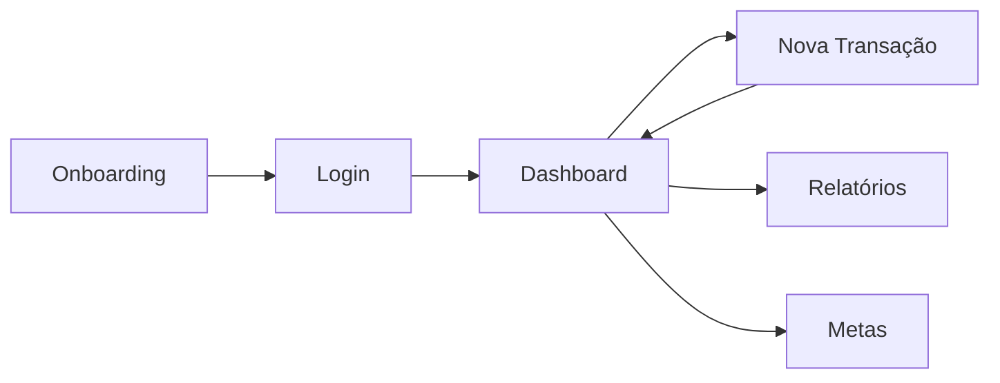

# 💰 FinançaFácil

<div align="center">


**Aplicativo de controle financeiro pessoal simples, intuitivo e acessível**

[](SEU_LINK_AQUI)
[](LICENSE)
[]()

[Ver Protótipo](#) • [Documentação](#documentação) • [Sobre o Projeto](#sobre-o-projeto)

</div>

---

## 📋 Índice

- [Sobre o Projeto](#sobre-o-projeto)
- [O Problema](#o-problema)
- [A Solução](#a-solução)
- [Funcionalidades](#funcionalidades)
- [Protótipo](#protótipo)
- [Design System](#design-system)
- [Jornada do Usuário](#jornada-do-usuário)
- [Tecnologias e Ferramentas](#tecnologias-e-ferramentas)
- [Decisões de UX/UI](#decisões-de-uxui)
- [Acessibilidade](#acessibilidade)
- [Como Visualizar](#como-visualizar)
- [Próximos Passos](#próximos-passos)
- [Autor](#autor)
- [Licença](#licença)

---

## 📖 Sobre o Projeto

O **FinançaFácil** é um aplicativo mobile de controle financeiro pessoal desenvolvido como projeto acadêmico para a disciplina de **Design de Interação e Interface (UX/UI)**. O projeto foi criado seguindo metodologias de design centrado no usuário, aplicando fundamentos de experiência do usuário (UX) e interface visual (UI).

### 🎯 Objetivo

Ajudar jovens adultos (18-35 anos) a controlar suas finanças pessoais de forma simples e intuitiva, reduzindo endividamento e facilitando a economia através de uma experiência digital sem fricção.

### 🎓 Contexto Acadêmico

- **Disciplina:** Design de Interação e Interface (UX/UI)
- **Instituição:** [Sua instituição]
- **Período:** 2026
- **Tipo:** Protótipo de alta fidelidade navegável

---

## 🔴 O Problema

### Contexto

Segundo pesquisa do SPC Brasil (2023), **62% dos brasileiros entre 18 e 35 anos não conseguem controlar suas despesas mensais** de forma eficaz. Os aplicativos financeiros disponíveis no mercado apresentam:

- ❌ **Interfaces complexas** com excesso de recursos desnecessários
- ❌ **Curvas de aprendizado altas** que desmotivam usuários iniciantes
- ❌ **Baixo engajamento** - abandono em 2-3 semanas de uso
- ❌ **Falta de clareza visual** sobre para onde o dinheiro está indo

### Dores Identificadas

1. **Invisibilidade dos gastos** - Usuários não sabem em quais categorias gastam mais
2. **Complexidade desnecessária** - Recursos avançados que a maioria nunca usa
3. **Dificuldade em criar orçamentos** - Processos confusos e demorados
4. **Falta de motivação** - Ausência de feedback positivo e progresso visível

---

## ✅ A Solução

O FinançaFácil resolve esses problemas através de:

### 🎯 Princípios de Design

1. **Simplicidade Radical**
   - Registro de transações em menos de 10 segundos
   - Apenas 2 campos obrigatórios (valor + categoria)
   - Interface limpa sem elementos desnecessários

2. **Visualização Clara**
   - Gráficos intuitivos ao invés de planilhas complexas
   - Cores consistentes (verde = receitas, vermelho = despesas)
   - Hierarquia visual bem definida

3. **Motivação Contínua**
   - Sistema de metas com progresso visual
   - Feedback positivo em conquistas
   - Gamificação sutil e não-infantil

4. **Acessibilidade**
   - Contraste WCAG 2.1 AA em todas as combinações
   - Botões com área de toque adequada (48px+)
   - Linguagem simples e direta

---

## ⚡ Funcionalidades

### Principais Features

📊 **Dashboard Intuitivo**
- Saldo disponível em destaque
- Resumo mensal (receitas vs despesas)
- Gráfico de pizza por categorias
- Transações recentes

💸 **Registro Rápido de Transações**
- Modal simplificado
- Categorização automática sugerida
- Campos mínimos obrigatórios
- Teclado numérico automático

📈 **Relatórios Visuais**
- Gráficos de evolução mensal
- Comparação entre períodos
- Análise por categoria
- Alertas de gastos acima do orçamento

🎯 **Sistema de Metas**
- Criação de objetivos financeiros
- Barra de progresso visual
- Sugestão de valor mensal para atingir meta
- Celebração ao atingir 100%

### Telas do Protótipo

1. **Onboarding** - Boas-vindas e apresentação do valor
2. **Login** - Acesso simplificado ao app
3. **Dashboard** - Visão geral das finanças
4. **Nova Transação** - Modal de registro rápido
5. **Relatórios** - Análises e gráficos detalhados
6. **Metas** - Objetivos e progresso

---

## 🎨 Design System

### Paleta de Cores

```css
/* Cores Primárias */
--primary-green: #27AE60;    /* Receitas, CTAs, saldo positivo */
--danger-red: #E74C3C;       /* Despesas, alertas */
--info-blue: #3498DB;        /* Links, destaques */

/* Cores Neutras */
--text-dark: #2C3E50;        /* Textos principais */
--text-gray: #7F8C8D;        /* Textos secundários */
--background-light: #ECF0F1; /* Fundos */
--white: #FFFFFF;            /* Fundos principais */
--border-light: #BDC3C7;     /* Bordas */
```

### Tipografia

- **Família:** Inter (Google Fonts)
- **Tamanhos:** 12px, 14px, 16px, 18px, 24px, 28px
- **Pesos:** Regular (400), SemiBold (600), Bold (700)

### Componentes

- **Botões:** Primary, Secondary, Destructive, Icon Button
- **Cards:** Padrão, Destaque (gradiente)
- **Inputs:** Text, Select, Textarea
- **Navegação:** Bottom Navigation (4 itens)
- **Gráficos:** Pizza (donut), Barras, Linha
- **Modais:** Bottom Sheet, Center Modal

### Espaçamento

Sistema baseado em **8px**:
- 8px, 16px, 24px, 32px, 40px, 48px

### Iconografia

- **Biblioteca:** Feather Icons
- **Tamanhos:** 16px, 20px, 24px

---

## 👥 Persona

### Marina Oliveira, 27 anos

<table>
<tr>
<td width="30%"><b>Profissão</b></td>
<td>Designer Gráfica em agência de publicidade</td>
</tr>
<tr>
<td><b>Renda</b></td>
<td>R$ 4.500,00/mês</td>
</tr>
<tr>
<td><b>Objetivos</b></td>
<td>Economizar para viagem internacional, quitar dívidas do cartão, criar reserva de emergência</td>
</tr>
<tr>
<td><b>Frustrações</b></td>
<td>Apps complexos demais, não consegue visualizar onde gasta mais, esquece de registrar gastos</td>
</tr>
<tr>
<td><b>Comportamento</b></td>
<td>Usa o celular constantemente, prefere soluções rápidas e visuais, valoriza design limpo</td>
</tr>
</table>

---

## 🗺️ Jornada do Usuário

### Fluxo Principal



### Etapas Detalhadas

#### 1. Onboarding (2 minutos)
**Objetivo:** Apresentar valor do app e configurar perfil básico
- Tela de boas-vindas
- Cadastro simplificado
- Configuração de renda mensal

#### 2. Dashboard (5 segundos)
**Objetivo:** Visão geral instantânea da situação financeira
- Saldo disponível em destaque
- Resumo mensal
- Gráfico de categorias
- Transações recentes

#### 3. Adicionar Transação (10 segundos)
**Objetivo:** Registro de despesas/receitas sem fricção
- Apenas 2 campos obrigatórios
- Teclado numérico automático
- Sugestão de categorias

#### 4. Análise (30 segundos)
**Objetivo:** Fornecer insights sobre padrões de gastos
- Gráficos de evolução
- Comparação mensal
- Alertas inteligentes

#### 5. Metas (15 segundos)
**Objetivo:** Motivar economia através de objetivos tangíveis
- Criação de metas
- Barra de progresso
- Sugestões de economia

---

## 🎨 Protótipo

### Link do Figma

🔗 **[Acesse o protótipo navegável aqui](SEU_LINK_FIGMA)**

### Como Navegar

1. Clique no botão ▶️ (Play) no canto superior direito do Figma
2. Comece pela tela "1 - Onboarding"
3. Interaja com os botões e elementos clicáveis
4. Use as setas de navegação inferior para mudar entre seções

### Capturas de Tela

<details>
<summary>📱 Ver Telas Principais</summary>

#### Dashboard


#### Nova Transação


#### Relatórios


#### Metas


</details>

---

## 🛠️ Tecnologias e Ferramentas

### Design

- **Figma** - Prototipação e design de interface
- **Feather Icons** - Biblioteca de ícones
- **Google Fonts (Inter)** - Tipografia

### Metodologias

- **Design Thinking** - Processo de ideação e validação
- **Design Centrado no Usuário** - Foco nas necessidades reais
- **Atomic Design** - Organização de componentes
- **Material Design** - Princípios de design mobile

### Referências

- [Nielsen Norman Group](https://www.nngroup.com) - Boas práticas de UX
- [Laws of UX](https://lawsofux.com) - Princípios aplicados
- [Material Design](https://material.io) - Guidelines mobile
- [WCAG 2.1](https://www.w3.org/WAI/WCAG21/quickref/) - Acessibilidade

---

## 🎯 Decisões de UX/UI

### Leis de UX Aplicadas

#### Lei de Hick
> O tempo para tomar uma decisão aumenta com o número de opções

**Aplicação:** Máximo de 4 itens na navegação principal. Formulários com campos mínimos.

#### Lei de Fitts
> O tempo para alcançar um alvo é função da distância e tamanho

**Aplicação:** Botão de ação principal no centro inferior (acesso fácil com polegar). Área de toque mínima de 48px.

#### Lei de Miller
> Pessoas conseguem manter 7±2 itens na memória de trabalho

**Aplicação:** Máximo de 6 categorias visíveis simultaneamente. Agrupamento lógico de informações.

#### Efeito Von Restorff
> Um item que se destaca será mais lembrado

**Aplicação:** Saldo em destaque com tamanho maior e cor diferenciada. Botão CTA em verde vibrante.

### Padrões de Design

- **F-Pattern:** Informações críticas no topo e esquerda
- **Z-Pattern:** Para telas com menos conteúdo (onboarding, login)
- **Progressive Disclosure:** Revelação gradual de funcionalidades
- **Smart Defaults:** Campos pré-preenchidos com valores prováveis

---

## ♿ Acessibilidade

### Conformidade WCAG 2.1 - Nível AA

✅ **Contraste de Cores**
- Textos normais: Mínimo 4.5:1
- Textos grandes: Mínimo 3:1
- Todas as combinações testadas e aprovadas

✅ **Navegação por Teclado/Touch**
- Todos os elementos interativos acessíveis
- Ordem de foco lógica e previsível
- Labels descritivos em todos os campos

✅ **Área de Toque**
- Botões com mínimo 48x48px
- Espaçamento de 8px entre elementos tocáveis
- Alvos grandes para facilitar interação

✅ **Linguagem**
- Português brasileiro simples e direto
- Evita jargões financeiros complexos
- Mensagens de erro claras e acionáveis

✅ **Representação Visual**
- Não depende apenas de cor para informação
- Ícones + texto em elementos importantes
- Padrões visuais em gráficos (para daltônicos)

### Testes Realizados

- ✅ WebAIM Contrast Checker - Todas combinações aprovadas
- ✅ Simulação de daltonismo (Stark plugin) - Informações distinguíveis
- ✅ Tamanho de toque - Todos elementos ≥ 48x48px

---

## 📚 Documentação

### Arquivos do Projeto

```
FinancaFacil/
├── README.md                          # Este arquivo
├── docs/
│   ├── Parte_1_Documento_Teorico.docx # Análise completa (1,5 pts)
│   ├── Parte_2_Guia_Figma.docx        # Tutorial passo a passo (3,5 pts)
│   ├── Parte_3_Roteiro_Video.docx     # Script para pitch (2,0 pts)
│   └── design_system_specs.md         # Especificações técnicas
├── assets/
│   ├── screenshots/                   # Capturas de tela
│   └── icons/                         # Ícones do projeto
└── LICENSE                            # Licença MIT
```

### Documentos Disponíveis

1. **[Documento Teórico](docs/Parte_1_Documento_Teorico.docx)** - Análise do problema, persona, jornada, decisões de UX/UI e acessibilidade
2. **[Guia do Figma](docs/Parte_2_Guia_Figma.docx)** - Tutorial completo para criar o protótipo do zero
3. **[Roteiro Vídeo Pitch](docs/Parte_3_Roteiro_Video.docx)** - Script detalhado para apresentação de 4 minutos
4. **[Especificações Técnicas](docs/design_system_specs.md)** - Design System completo com medidas exatas

---

## 👨‍💻 Como Visualizar

### Requisitos

- Navegador web moderno (Chrome, Firefox, Safari, Edge)
- Conexão com internet
- Conta Figma (gratuita) - opcional para edição

### Passo a Passo

1. **Acesse o protótipo:**
   ```
   https://www.figma.com/proto/SEU_ID_AQUI
   ```

2. **Modo de visualização:**
   - Clique no botão ▶️ (Play) no canto superior direito
   - Ou acesse diretamente o link de apresentação

3. **Navegação:**
   - Comece pela primeira tela (Onboarding)
   - Clique nos botões e elementos interativos
   - Use a navegação inferior para mudar entre seções

4. **Dicas:**
   - Pressione `R` para reiniciar o fluxo
   - Pressione `Esc` para sair do modo de apresentação
   - Use as setas do teclado para navegar entre frames

---

## 🚀 Próximos Passos

### Fase 1: Validação (Curto Prazo)
- [ ] Testes de usabilidade com 5-8 usuários reais
- [ ] Coleta de feedback qualitativo
- [ ] Iteração baseada em insights

### Fase 2: Expansão de Funcionalidades (Médio Prazo)
- [ ] Integração com bancos (Open Banking)
- [ ] Múltiplas contas e cartões
- [ ] Categorização automática com IA
- [ ] Notificações inteligentes
- [ ] Modo escuro (Dark mode)

### Fase 3: Desenvolvimento (Longo Prazo)
- [ ] Desenvolvimento do MVP (React Native / Flutter)
- [ ] Backend e banco de dados
- [ ] Implementação de segurança (criptografia)
- [ ] Testes beta fechado
- [ ] Lançamento na App Store / Google Play

### Melhorias Futuras
- Comparação social (opcional)
- Insights com IA
- Exportação de relatórios
- Suporte a múltiplas moedas
- Versão web (PWA)

---

## 🎓 Aprendizados

### O que aprendi com este projeto

1. **Metodologia de Design**
   - Importância da pesquisa de usuário antes de desenhar
   - Validação de hipóteses com personas
   - Iteração baseada em feedback

2. **Habilidades Técnicas**
   - Domínio do Figma (componentes, variantes, auto-layout)
   - Criação de Design Systems escaláveis
   - Prototipação de interações complexas

3. **UX/UI Design**
   - Aplicação prática de leis de UX
   - Equilíbrio entre estética e funcionalidade
   - Importância da acessibilidade desde o início

4. **Comunicação**
   - Documentação técnica clara
   - Apresentação de decisões de design
   - Storytelling em vídeo pitch

---

## 📊 Estatísticas do Projeto

- ⏱️ **Tempo de desenvolvimento:** 40+ horas
- 🎨 **Telas criadas:** 6 principais + variações
- 🎯 **Componentes reutilizáveis:** 15+
- 📐 **Especificações documentadas:** 50+ itens
- 📄 **Páginas de documentação:** 60+
- 🎬 **Duração do vídeo pitch:** 4 minutos

---

## 👤 Autor

**[Seu Nome]**

- 🎓 Estudante de [Seu Curso]
- 🏫 [Sua Instituição]
- 📧 Email: [seu.email@exemplo.com]
- 💼 LinkedIn: [linkedin.com/in/seu-perfil](https://linkedin.com/in/seu-perfil)
- 🎨 Behance: [behance.net/seu-perfil](https://behance.net/seu-perfil)
- 🐙 GitHub: [@seu-usuario](https://github.com/seu-usuario)

---

## 🤝 Contribuições

Este é um projeto acadêmico, mas sugestões e feedback são sempre bem-vindos!

Se você quiser:
- 🐛 Reportar bugs ou problemas no protótipo
- 💡 Sugerir melhorias de UX/UI
- 📖 Contribuir com a documentação
- 🎨 Propor variações de design

Abra uma [issue](https://github.com/seu-usuario/financafacil/issues) ou entre em contato diretamente!

---

## 📄 Licença

Este projeto está sob a licença MIT. Veja o arquivo [LICENSE](LICENSE) para mais detalhes.

```
MIT License

Copyright (c) 2026 [Seu Nome]

Permission is hereby granted, free of charge, to any person obtaining a copy
of this software and associated documentation files (the "Software"), to deal
in the Software without restriction...
```

---

## 🙏 Agradecimentos

- **Prof. [Nome do Professor]** - Orientação e feedback valioso
- **Colegas de turma** - Discussões enriquecedoras sobre UX/UI
- **Comunidade de design** - Inspiração e referências
- **Usuários que testaram** - Feedback essencial para melhorias

---

## 📚 Referências

### Artigos e Pesquisas
- SPC Brasil. (2023). Pesquisa sobre endividamento dos brasileiros
- Nielsen, J. (2020). 10 Usability Heuristics for User Interface Design
- Norman, D. (2013). The Design of Everyday Things

### Design Systems
- Material Design Guidelines - Google
- Human Interface Guidelines - Apple
- Fluent Design System - Microsoft

### Ferramentas e Recursos
- [Figma Community](https://www.figma.com/community)
- [Feather Icons](https://feathericons.com/)
- [WebAIM Contrast Checker](https://webaim.org/resources/contrastchecker/)
- [Laws of UX](https://lawsofux.com/)

---

<div align="center">

### ⭐ Se este projeto foi útil para você, considere dar uma estrela!

**Desenvolvido com 💚 por [Seu Nome]**

**2026 - Projeto Acadêmico de UX/UI Design**

[🔝 Voltar ao topo](#-finançafácil)

</div>
